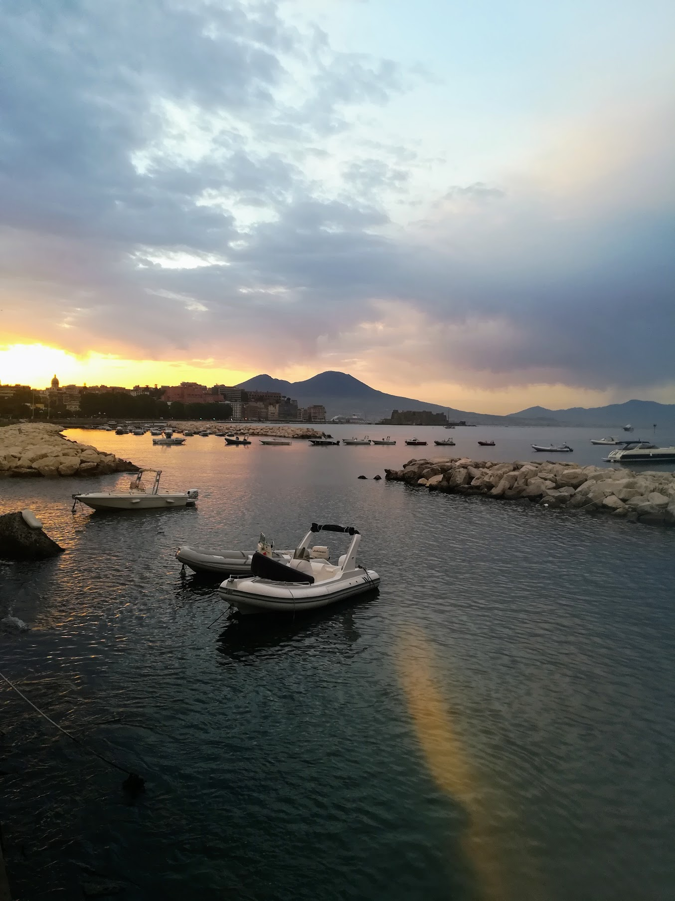

+++
date = "2025-02-13T20:20:03+01:00"
draft = false
title = "Down Memory Lane"
description = "Vedi Napoli e poi muori"
series = [""]
categories = ["Travel"]
tags = ["time", "memory"]
# [Grass maze pathway photo photo – Free Bush Image on Unsplash](https://unsplash.com/photos/grass-maze-pathway-photo-bQYV0dz9GjE)
image = "images/maxwell-young-bQYV0dz9GjE-unsplash.jpg"
+++

## Reminiscing

Literature can sometimes intersect with science, or indeed anticipate scientific discoveries by decades.
Admittedly, art can afford to do without much evidence, to be backed by intuition and personal experience.
One hundred years ago, Marcel Proust made memory the central theme of a series of novels,
and distinguished between two types of recollections,
long before neuroscience emerged as a field of study.
In his experience, memory retrieval could be voluntary, a consious effort to remember past events,
or involuntary, stimulated by the senses.
The latter form of retrieving memories is otherwise known as reminiscing.

If voluntary retrieval is the memory of intelligence and control,
the one that you might most closely associate with your rational self,
then involuntary retrieval is the memory of the senses, and requires a degree of surrender.
Voluntary retrieval is very efficient to find what you are looking for,
only you are usually looking to remember a specific event, a feeling, a thought,
which is exactly what you get, and you miss out on the rest of the picture.
You cannot make the past more present that way, you can only retrieve a fragment of it.
On the other hand, remininscing in an involuntary manner is not motivated by a specific goal,
it gives your mind the freedom to wander and wonder,
to explore at will the depths of your memory.
When you engage in it, past and present intertwine, for you,
that is the kind of time travel that humans have access to.
Though, it is not easy to let your mind wander in 2025,
it requires to do away with external stimuli,
such as scrolling social media or even listening to music too intensly.
My advice: go for a walk without your phone,
find your pace, and embrace boredom if necessary.

For my part, I was in Naples last week.
The last time that I was there was four years ago.
There are not many places that I visited more than once, but I had wanted to go back for some time.
As it turns out, there was much more to this second visit than volcanos, ruins, and pizzas,
though they still played an integral part.

Incidentally, remininscing comes easy when you visit a place for a second time.
More often than not, you will find yourself reminisicing because of a smell, a place, a tune.
That is when the whole experience comes back to you:
I could see myself in places that I had already been,
remember who I had talked to and what the conversations were about,
I remembered the thoughts and feelings that I was having at the time, my dreams and desires.

## Winds of change

Where did that leave me then?
My first trip to Naples took place during a very different phase of my life:
I had just graduated and started my first job.
I had just moved to Barcelona,
and the pandemic was only barely behind us, the restrictions were not fully lifted yet.
There was so much for me to experience and explore, and I did a lot of that in the years since.
I am a very different person to that 24 year-old boy now.

There are some things that have not changed, though.
One thing that I could never handle was routine.
It really gets to me when I am under the impression that I am not making progress,
than my weeks are, by and large, the same.
Sure, I can make new friends, start relationships, get better at my job and so on and so forth,
but I regularly have a feeling of stagnation when I settle into a routine for a period of time,
and I hate that.
I also feel like people have very different personalities when they do something out of the ordinary,
and I like that version of people.

Though now, I have come to a stage where I want the best of both worlds:
I want to have a home, a place that I can come back to,
a relatively settled life in which I feel comfortable,
but I also want to have that feeling that I can easily break away from the routine,
and to do so without too many constraints.
The good news about wanting to change in such a way is that you have already had both personalites,
at different times of your life, and in different places.
I tend to liken it to cutting down on alcohol after your student years,
while preserving some of the drunk version of your personailty in your regular self.
That might be one version of what growing old and wise is about, in a nutshell.

