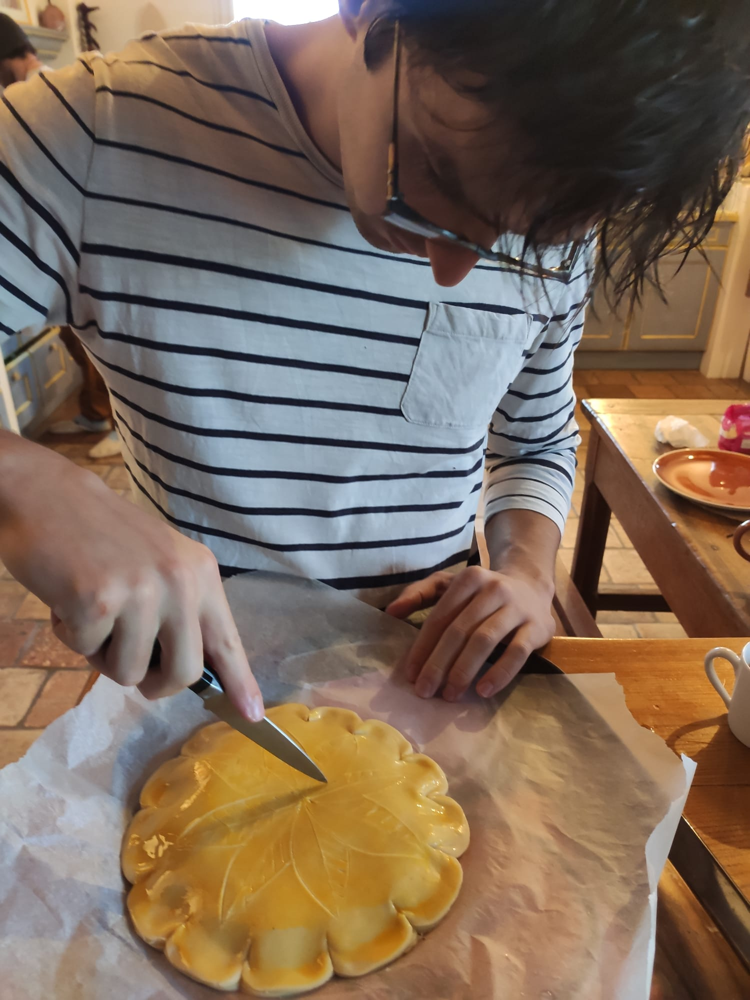

+++
date = "2025-02-08T23:09:41+01:00"
draft = false
title = "January Queen"
description = "The only tradition that matters"
series = ["Foodlosophy"]
categories = ["Food"]
tags = ["cake", "galette"]
# [Shallow focus photography white crown hanging decor photo – Free Crown Image on Unsplash](https://unsplash.com/photos/shallow-focus-photography-white-crown-hanging-decor-3E3AVpvlpao)
image = "images/megan-watson-3E3AVpvlpao-unsplash.jpg"
+++

## Tradition

Traditions are not really my thing, but I do like food,
and I like that there are certain foods that are only eaten at specific times of the year.
There is something special about that, it builds memories in a very unique way,
and memory is definitely one of my obsessions.

Case in point, I would have trouble getting into the new year atmosphere without eating a king cake,
a cake that is traditionally eaten on January 6th and throughout the rest of the month.
Over here in Europe, there are several variations of this cake, they depend on the country and region
([King cake](https://en.wikipedia.org/wiki/King_cake)).
My focus is on the French version, and specifically the northern French version, which is an indication as to my own origins.
In French, the cake is called galette des rois, but I will simply refer to it as galette most of the time.

At its core, the galette is not a very fancy cake, it is a puff pastry filled with almond cream,
which makes it delociously fluffy and buttery, and filled with one of the best flavors in the world.
Making it to kickstart the year is always a highlight, not to mention the atmosphere of sharing it with friends.
You should try sometime!

## Making-of

You might be wondering how I got into it.
The cake is certainly omnipresent in France each January, but that is not the reason.
Most people just buy it, and that is perfectly fine.
Profesional bakers have vast experience in making it, and the result almost never disappoints.
My interest actually goes back to my childhood, as many things do.
I come from a family where cooking homemade food was not very common:
my parents had both had stay-at-home mothers and rejected much of that lifestyle for themselves.
They were working much of the day, and they did not want to spend the rest of it in the kitchen.
However, my mother did sometimes make quiches, and every once in a while she would make the crust herself too.
I cannot understate how important it is to me to eat a quiche with a homemade crust, as opposed to a store-bought one.
It is just not the same food.

In terms of food, my childhood was not the best, but it did have a few saving graces.
Now I hope you understand why I made a point about memory earlier.
Naturally, when I started cooking myself, I did not start with a lot of experience,
and I had little clue about what to make.
In fact, and I hope my Italian friends can forgive me,
I did not really know that eating pasta with a sauce was a thing until university.
Or I just imagined a tomato sauce added directly on top after cooking,
but nothing like cacio e pepe (the best), or even a halfway-decent pasta al pomodoro.
But one thing that I did know that I wanted to make were crusts.
I could go on and on about the different types of crusts, but to keep it short:
the crust that most often goes with a quiche is a shortcrust pastry.
As it happens, it is good that I started with that, because it is the easiest to make,
which is also why you should never buy it.
But as time went on and I got more experience, I started to ache to try other types of crusts and doughs.
Puff pasty was at the end of that journey, not that it is vastly more difficult than a shortcrust pastry,
but it is more time-consuming, and I suppose it requires a bit more technique.
Specifically, the galette turns out best with an inverted puff pastry,
inverted because the butter is wrapped around the flour, not the other way around.
Needless to say that I also very much recommend agaisnt buying puff pastry.

## Decoration

I was never much of an artist.
Or maybe I just did not adhere to the traditional sense of the word.
After all, I did say that I was not one for traditions.
As a matter of fact, I do wonder if the decoration of a galette is more of an artistic activity than the making of the puff pastry.
It is very clear to me where true creation lies.
Though, I suppose that society has a tendancy to deem artistic any activity that embellishes to an extent.
What is certain is that true appreciation for food is an experience that involves all five senses, not only taste.
The sound of a baguette is something to behold.

